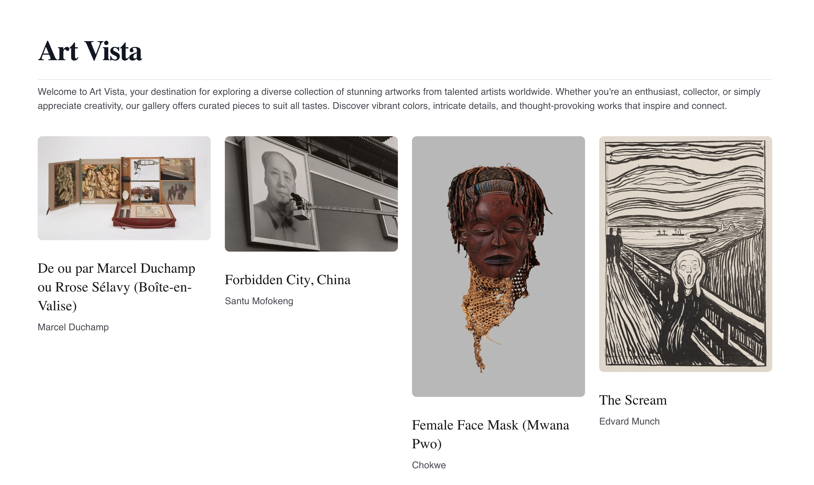

# 🖼️ Art Vista



## [Project Brief](https://lunaceee.notion.site/Art-Vista-project-summary-1bdbcf91f60680bfbcebd7e683559599?pvs=25#1c1bcf91f60680208b72fe0c1afcc36d)

This is a [Next.js](https://nextjs.org) project bootstrapped with [`create-next-app`](https://nextjs.org/docs/app/api-reference/cli/create-next-app).

## Run project locally

```bash
npm run dev
# or
yarn dev
# or
pnpm dev
# or
bun dev
```

Open [http://localhost:3000](http://localhost:3000) with your browser to see the result.

## Run Storybook locally

```bash
npm run storybook
# or
yarn storybook
# or
pnpm storybook
# or
bun storybook
```

Open [http://localhost:6006](http://localhost:6006) with your browser to see the result.

## Deploy on Vercel

### [Demo](https://art-vista-a6irtvptf-lunaceees-projects.vercel.app/)
